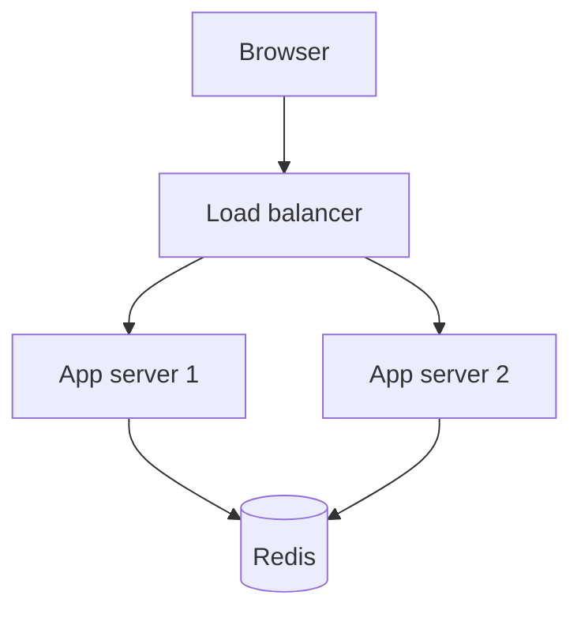
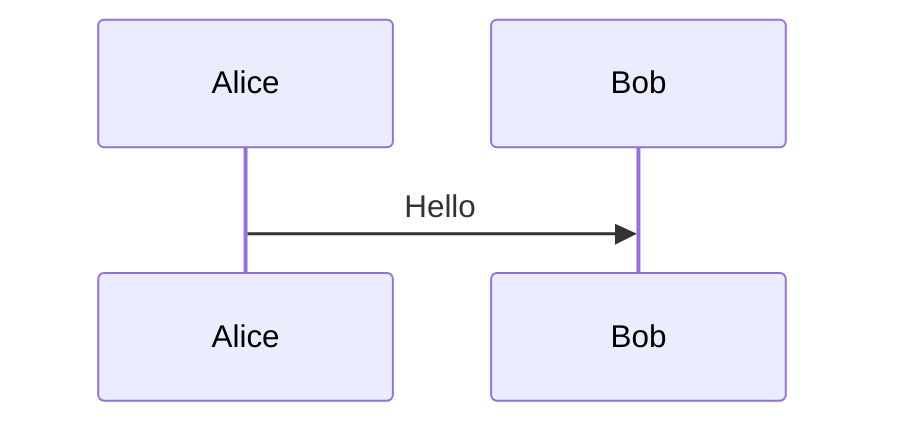
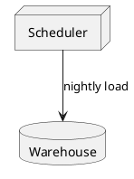

# Platform notes

Some prose about the platform.

## Request path

```mermaid
graph TD
  client[Browser] --> lb[Load balancer]
  lb --> app1[App server 1]
  lb --> app2[App server 2]
  app1 --> cache[(Redis)]
  app2 --> cache
```

## Login sequence

```mermaid
sequenceDiagram
  Alice->>Bob: Hello
```

## Batch jobs

```plantuml
@startuml
node "Scheduler" as cron
database "Warehouse" as dw
cron --> dw : nightly load
@enduml
```
